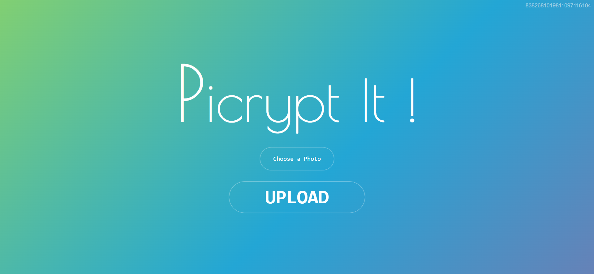

### Abstract

Inspired by the principle "why send less, when you can send more," Picrypt is a user-friendly software featuring a clean and simplistic interface, designed for inscribing digital color images with passcode-protected messages. This software allows users to download and locally save these inscribed images, which can then be sent digitally across the globe while preserving and protecting the embedded data message. The passcode used to inscribe the messages serves as the key for successful decryption, ensuring that the messages remain secure and accessible only to intended recipients.

### Introduction

In today's digital age, billions of images are shared among people every day. Often, these images require accompanying descriptions, especially in professional contexts such as journalism, where detailed reports must be submitted alongside photographs. Traditional methods involve sending text separately, which can be cumbersome and insecure. Picrypt addresses this challenge by enabling users to embed descriptive text directly into images, protected by a passcode.

### Features

#### User-Friendly Interface

Picrypt boasts a clean and simplistic user interface, making it accessible and easy to use for individuals of all technical backgrounds. The software's design emphasizes simplicity and efficiency, allowing users to inscribe images with messages using just a few clicks.

#### Passcode Protection

To ensure that the embedded messages remain secure, Picrypt employs passcode protection. The passcode acts as the key to decrypt the inscribed messages, guaranteeing that only intended recipients can access the data.

#### Local Storage and Sharing

Once an image is inscribed with a message, it can be downloaded and saved locally. Users can then share the image digitally across the globe, with the confidence that the embedded message remains protected and intact throughout the transmission.

### Technical Implementation

#### Data Encryption

Picrypt uses advanced encryption techniques to secure the data embedded within images. The data is encrypted using Vernam Cipher and Playfair Cipher before being inscribed into the image. This ensures that even if the image is intercepted, the message remains unreadable without the correct passcode.

#### Pixel-Based Inscription

The software leverages the pixel intensity values of a color image to inscribe encrypted data into the image on a pixel-by-pixel basis. This method preserves the original components, details, quality, and aspect ratio of the image, ensuring that the visual integrity of the image is maintained.

#### Parity Check

To maintain the consistency and integrity of the inscribed data, Picrypt implements an odd/even parity check. This additional layer of validation helps to ensure that the data remains accurate and consistent throughout the process.

### Use Cases

#### Journalism

Journalists can use Picrypt to embed detailed descriptions of situations directly into photographs. This simplifies the reporting process and ensures that critical information is securely transmitted alongside the images.

#### Secure Communication

Picrypt can be used for secure communication in various contexts where sensitive information needs to be shared alongside images. By embedding the message directly into the image and protecting it with a passcode, users can ensure that their communication remains confidential.

### Conclusion

Picrypt represents a significant advancement in the way we share images and information. By combining user-friendly design with robust security features, Picrypt offers a powerful tool for embedding and protecting messages within digital images. Whether for professional use in journalism or secure personal communication, Picrypt provides a reliable and efficient solution for inscribing and sharing information.

### Future Work

Future enhancements to Picrypt could include support for different image formats, improved encryption algorithms, and the ability to embed larger amounts of data. Additionally, expanding the software's compatibility with various operating systems and devices will further enhance its usability and accessibility.

### Installation Instructions

1. Download the repository as a ZIP file

2. Extract the downloaded file
3. Run Picrypt-It.exe
